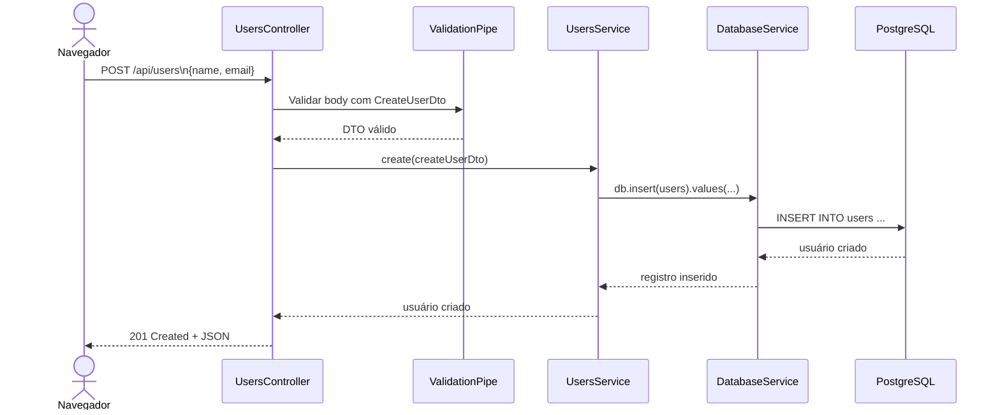
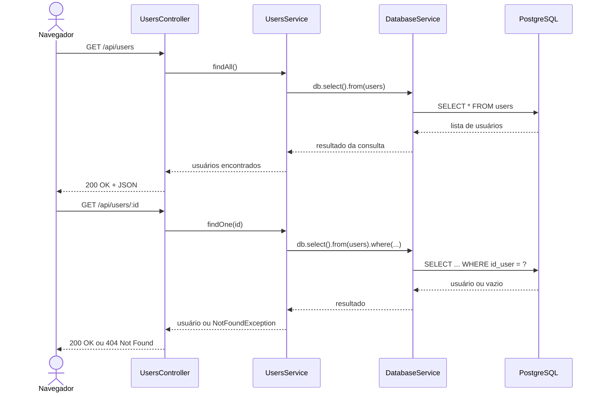
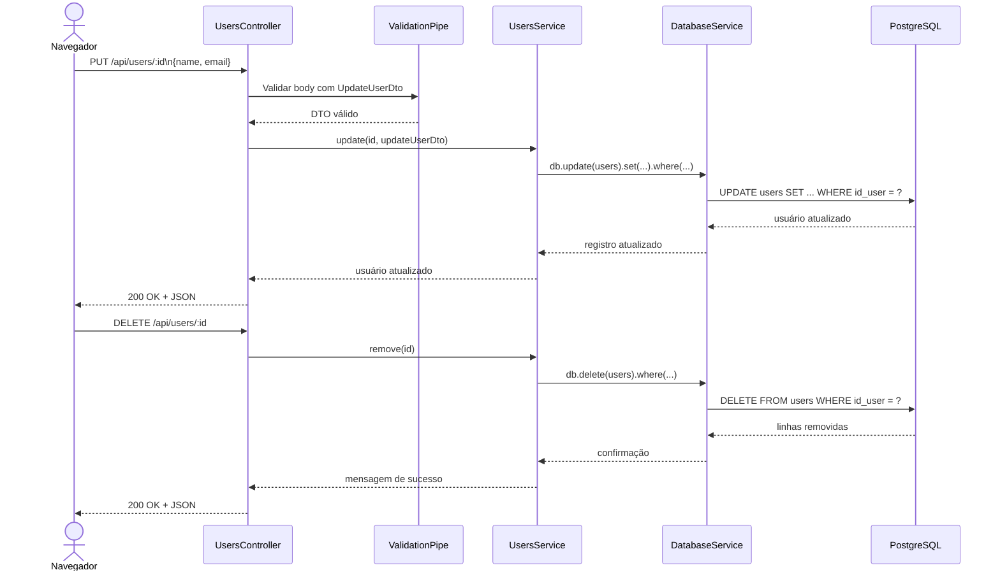

# CRUD simples com NestJS, Drizzle e PostgreSQL

Aplicação web simples para realizar CRUD de usuários com NestJS no servidor, Drizzle ORM no mapeamento do esquema e PostgreSQL no armazenamento.

## Tabela usada

O projeto trabalha com a tabela `users` abaixo:

```sql
CREATE TABLE users (
  id_user SERIAL NOT NULL PRIMARY KEY,
  name VARCHAR(100) NOT NULL,
  email VARCHAR(100)
);
```

## Como o projeto organiza essa tabela

Neste projeto, a definição da tabela aparece em duas camadas diferentes:

- No banco de dados, a tabela precisa existir fisicamente no PostgreSQL.
- No código, o arquivo `users.schema.ts` descreve essa mesma estrutura para o Drizzle ORM.

Em outras palavras, `src/users/users.schema.ts` não cria a tabela sozinho. Ele define o esquema que o código vai usar para montar consultas com segurança de tipos. A criação física da tabela continua sendo feita no PostgreSQL com o comando SQL mostrado acima.

## Significado dos principais arquivos

### Arquivos do módulo de usuários

- `src/users/users.schema.ts`
  Define o esquema da tabela `users` no Drizzle. Aqui ficam o nome da tabela, os nomes das colunas, seus tipos e restrições básicas, como `notNull()`.

- `src/users/dto/create-user.dto.ts`
  Define o formato esperado para criar um usuário. Também concentra as validações da entrada, como obrigatoriedade do nome, tamanho mínimo e formato de e-mail.

- `src/users/dto/update-user.dto.ts`
  Define o formato esperado para atualizar um usuário. Como a atualização é parcial, os campos são opcionais, mas continuam validados quando enviados.

- `src/users/users.controller.ts`
  Recebe as requisições HTTP da API, como `GET`, `POST`, `PUT` e `DELETE`. O controller extrai parâmetros e corpo da requisição e delega a regra de negócio para o service.

- `src/users/users.service.ts`
  Contém a regra de negócio do CRUD. É o service que usa `DatabaseService` e o schema `users` para inserir, consultar, atualizar e remover registros da tabela.

- `src/users/users.module.ts`
  Agrupa as partes do domínio de usuários dentro do NestJS. O módulo registra o `UsersController`, o `UsersService` e importa o `DatabaseModule` para disponibilizar acesso ao banco.

### Arquivos de banco

- `src/database/database.service.ts`
  Cria a conexão com o PostgreSQL usando as variáveis de ambiente e instancia o Drizzle com o schema do projeto. Esse serviço expõe `db`, que é usado pelo `UsersService`.

- `src/database/database.module.ts`
  Torna o `DatabaseService` disponível para os outros módulos da aplicação.

### Arquivos de inicialização

- `src/app.module.ts`
  É o módulo raiz da aplicação. Ele carrega as configurações do `.env`, registra os módulos principais e configura o atendimento de arquivos estáticos.

- `src/main.ts`
  É o ponto de entrada da aplicação NestJS. Aqui a aplicação é inicializada, as validações globais são ativadas e o servidor começa a escutar na porta configurada.

## Fluxo da requisição até a tabela

Quando uma requisição chega em `POST /api/users`, o fluxo principal é este:

1. `users.controller.ts` recebe a requisição.
2. O Nest valida o corpo com `create-user.dto.ts`.
3. `users.service.ts` aplica a lógica de criação.
4. `database.service.ts` entrega a conexão com o banco.
5. O Drizzle usa `users.schema.ts` para montar o `INSERT` na tabela `users`.

## Diagramas UML das requisições HTTP

Os diagramas abaixo representam, em sequência, como a requisição HTTP atravessa as camadas da aplicação.

### 1. Criação de usuário (`POST /api/users`)



### 2. Consulta de usuários (`GET /api/users` e `GET /api/users/:id`)



### 3. Atualização e remoção (`PUT /api/users/:id` e `DELETE /api/users/:id`)



## Requisitos

- Node.js
- npm
- PostgreSQL

## Configuração

1. Instale as dependências:

```bash
npm install
```

2. Crie ou ajuste o arquivo `.env` na raiz do projeto:

```env
PORT=3000

DB_HOST=localhost
DB_PORT=5432
DB_USER=postgres
DB_PASSWORD=123
DB_NAME=bdaula
```

3. Crie a tabela no PostgreSQL:

```sql
CREATE TABLE users (
  id_user SERIAL NOT NULL PRIMARY KEY,
  name VARCHAR(100) NOT NULL,
  email VARCHAR(100)
);
```

## Execução

```bash
npm run dev
```

Abra no navegador:

```text
http://localhost:3003
```

## Rotas da API

- `GET /api/users`
- `GET /api/users/:id`
- `POST /api/users`
- `PUT /api/users/:id`
- `DELETE /api/users/:id`
